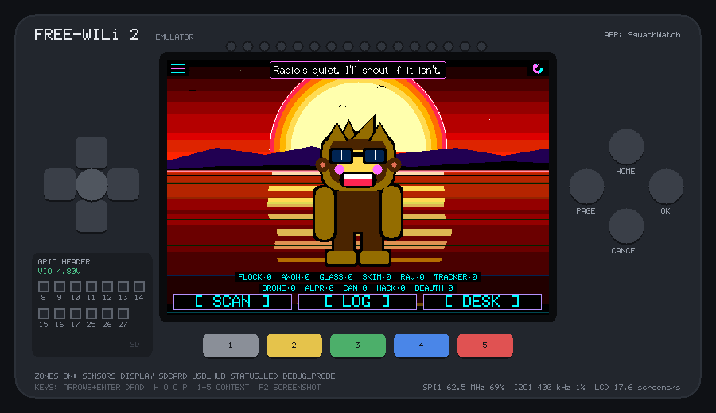
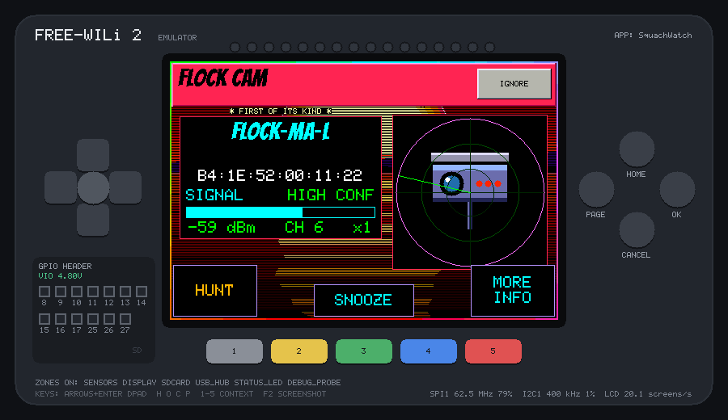

# SquachWatch for the FREE-WILi 2

[SquachWatch](https://github.com/skizzophrenic/SquachWatch-CYD), the
surveillance-device detector for the ESP32 "Cheap Yellow Display", running
on the [FREE-WILi 2](https://freewili.com). It uses SquachWatch's own
firmware sources, unmodified (the `SquachWatch-CYD` submodule), and supplies
the FREE-WILi 2 underneath them in `port/`: screen, touch, buttons, clock,
SD card and radios.




All of SquachWatch's UI is here at the 480×320 of its 3.5" build, including
Squachy, the alert cards, HUNT, LOG, DESK, settings, the dex and diagnostics.
Detections come from the FREE-WILi 2's stock Wi-Fi and Bluetooth scans.

Landscape only: SquachWatch's rotate button also offers portrait, which the
port doesn't draw. The screen stops updating until you rotate back to
landscape.

## What the stock radio can see

The FREE-WILi 2's radios are on its ESP32-C5, and FREE-WILi's stock
firmware there offers two things to an app: an access-point scan (BSSID,
signal, channel, security, SSID) and a Bluetooth LE scan (name, address,
signal). The port runs them in turn (3 s of Bluetooth, then a Wi-Fi scan).
It turns each network into the beacon frame SquachWatch's parser expects
and each Bluetooth device into an advert. So SquachWatch's own tables and
rules make every decision.

**Detected:** anything SquachWatch knows by a Wi-Fi hardware prefix or
network name, and Bluetooth devices by name:

- `FLOCK`
- `AXON`
- `ALPR`
- `CAMERA`
- `RING`
- `HACKER`: Flipper's prefix and name, `Pineapple_`, `pwned`
- `EVILTWIN`: one SSID, two BSSIDs that disagree about encryption
- the Bluetooth name rules, such as the Flock and skimmer names

**Not detected yet:** anything that needs more than a stock scan gives:

- the advert payload: service UUIDs and company IDs, which means AirTags,
  SmartTags, Google tags, Tile, iBeacons, Remote ID drones, camera glasses,
  Raven, and Flipper's UUIDs;
- raw 802.11 frames: deauth floods, probe requests, the Pwnagotchi beacon;
- Bluetooth Classic, for HC-05-style skimmers that don't advertise over BLE.

The plan for those is a custom ESP32-C5 firmware that passes raw frames
and adverts through. `port/radio_fw2.cpp` is the only file that changes,
because SquachWatch's callbacks already take raw frames.

The SquachWatch-to-SquachWatch mesh is off: its cipher needs mbedtls, and
the port refuses rather than fake it. Diagnostics will say
`crypto self-test FAIL`. Over-the-air updates are hidden; the FREE-WILi 2
installs apps its own way.

## Install it on your FREE-WILi 2

1. Download `squachwatch.uf2` from the latest
   [release](https://github.com/dfdarty/squachwatch-fw2/releases).
2. Copy it to the `apps` folder on the FREE-WILi 2's SD card. Any of these
   works:
   - the FreeWili GUI's file transfer;
   - the device's File System menu: `k 1` hands the SD card to your PC as
     a USB drive, and `k 0` gives it back;
   - WiliBSP's `fw install-app squachwatch.uf2`.
3. On the device, open **Apps** and choose **SquachWatch**.

It runs on the display processor with the stock firmware on the MAIN
processor and the ESP32-C5, whose scans it uses. Hold HOME for 5 s to
leave it. Its log and settings are kept on the SD card, under
`/appdata/squachwatch/`.

## Using it

- **Touch** works as on the CYD.
- **Grey, yellow, green** press SCAN, LOG and DESK on the button bar. A
  quick press counts even between two slow frames: the button stays down
  until SquachWatch has drawn two frames with it.
- **HOME held 5 s** leaves; **PAGE held 5 s** shows About.

On first start SquachWatch shows its walkthrough, then asks for your zone.
The clock comes from the FREE-WILi 2's real-time clock, and SquachWatch
writes it back when it learns the time.

On the SD card, under `/appdata/squachwatch/`:

- `squachwatch-<day>.log` holds SquachWatch's detection log, as on the CYD;
- `nvs/<namespace>.nvs` holds its settings (the ESP32's NVS, as text).

## Build it

```sh
git clone --recurse-submodules https://github.com/dfdarty/squachwatch-fw2
git clone --recurse-submodules https://github.com/dfdarty/freewili2-emu ~/freewili2-emu
cd squachwatch-fw2
~/freewili2-emu/tools/fw2emu run .                  # in a window; the SD card is ./sdcard
~/freewili2-emu/tools/fw2emu test .                 # run test.txt: PASS or FAIL
~/freewili2-emu/tools/fw2emu hwcheck --fetch-toolchain .   # fits the chip? also builds the UF2
```

This needs emulator 2.x (the workflows use `dfdarty/freewili2-emu@v2`):
1.2.0 added the radio model and C++ apps, 2.0.0 the chip-speed timing, 2.1.0
the UF2 the release attaches, and 2.2.0 the browser page from
`fw2emu-web.json`.
In the emulator, `--radio @town` fills the air with a small town's worth
of cameras, a Pineapple and a Flipper. `radio ap …` and `radio ble …` in a
script add more (see the emulator's
[scripting guide](https://dfdarty.github.io/freewili2-emu/scripting/)).

`test.txt` starts with two ordinary networks and two Bluetooth devices,
then brings in a Flock camera and a Flipper. It checks both alerts, the
log lines on the SD card and the saved settings. It runs under
AddressSanitizer too (`fw2emu test --sanitize .`).

On the real chip (`fw2emu hwcheck`): 929 KB image, 231 KB of SRAM, 22.3 KB
of stack, and a 5 MB heap in PSRAM.

## Speed

The emulator runs app code at the RP2350's estimated speed (from emulator
2.0.0), and the port logs where each pass of the
main loop goes every 5 s:

```text
[fw2] per pass: loop 65.0 ms, screen 30.0 ms, chores 0.4 ms (10 passes/s)
```

`loop` is SquachWatch's own `loop()`: drawing the scene and the UI into the
480×320 frame, in software. `screen` is the port finding the rows that
changed and sending them to the LCD (about half of it on the SPI wire).
`chores` are input, the radio feed and saving settings.

Estimates for the board: `loop` comes out at about 65 ms natively and
150 ms in a browser build of the emulator, so expect roughly 4 to 10 frames
a second, and slower where PSRAM cache misses bite: the whole app runs from
PSRAM, which the estimate leaves out. The board will settle it.

## How it's built

- `CMakeLists.txt` compiles SquachWatch's `src/`, the same files its PC
  simulator builds, plus `detection.cpp` and `sd_log.cpp`. It uses
  SquachWatch's simulator headers for the in-memory TFT_eSPI panel and the
  XPT2046 touch code.
- `port/platform_fw2.cpp` handles the board:
  - runs `setup()` and `loop()`;
  - after each loop, sends the rows that changed to the LCD by DMA;
  - turns capacitive touch into the raw readings SquachWatch's calibration
    expects;
  - puts the heap in PSRAM.
- `port/radio_fw2.cpp` handles the scans, as above.
- `port/sd_fw2.cpp` provides SD and NVS over the MAIN processor's card.
- `port/*.h` stand in for Arduino, ESP-IDF and NimBLE, as much as
  SquachWatch uses.

## License

GPL-3.0, as SquachWatch. See [LICENSE](LICENSE). SquachWatch, Squachy and
SquachWare are the work of TalkingSasquach and SquachWatch's contributors.
This is an unofficial port, not affiliated with SquachWatch or FREE-WILi
LLC.
